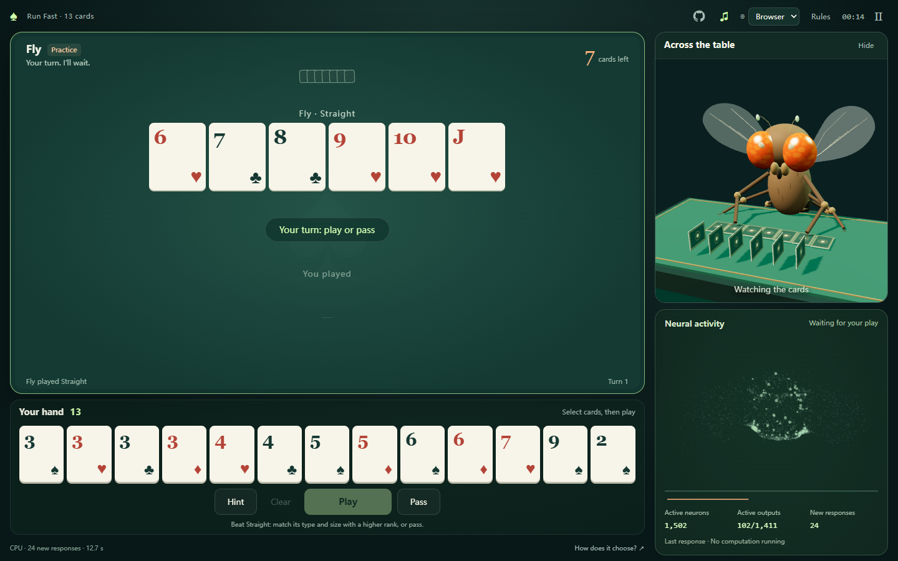

# Fly Poker

**English** · [简体中文](README.zh-CN.md) · [日本語](README.ja.md)

A two-player, 13-card shedding game against a simulated fruit-fly brain. Play all your cards first to win.

**[Play the demo](https://fly-poker.piphipsi.com/)** · [Source code](https://github.com/HappyAny/fly-poker)



- Practice and serious opponents, hints, passing, pause and restart.
- English, Simplified Chinese and Japanese. The game follows your browser language initially and remembers a manual selection.
- Original lounge-jazz BGM with volume and mute controls; music pauses with the game.
- A mobile layout with the table and controls above the 3D fly and neural activity.
- The complete prepared connectome runs locally through WebGPU or a CPU Worker. The first compressed model download is about 39 MB.

## Run locally

With Python 3 installed:

```sh
git clone https://github.com/HappyAny/fly-poker.git
cd fly-poker
python serve-local.py
```

Open <http://localhost:8891/>. The repository includes the model, policies, music and Three.js. No account, API key or server inference is needed; Python serves static files.

## Develop and build

With Node.js 20 or later:

```sh
npm ci --ignore-scripts
npm test
npm run build
```

The HTML, CSS, JavaScript and WGSL in `dist/` are the website source. `client/brain_cpu_block.rs` is the CPU WebAssembly kernel; `tools/compose-table-lounge.py` generates the music. `client-assets.json` lists the runtime assets, and the build produces a SHA-256 manifest.

To rebuild the CPU kernel, install Rust's `wasm32-unknown-unknown` target and run:

```sh
rustc --edition 2021 --crate-type cdylib --target wasm32-unknown-unknown -C opt-level=3 -C panic=abort -C lto=yes client/brain_cpu_block.rs -o dist/brain-cpu.wasm
```

Regenerating the music requires NumPy, SciPy and SoundFile with MP3 encoding support. `python tools/export-model.py --source path/to/graph.npz` exports a prepared graph with fields `ids`, `indptr`, `indices`, `weights`, `stim`, `stim_group` and `readout`. These regeneration steps are optional; the game runs with the bundled files.

## Deploy to Cloudflare

```sh
npm run build:cloudflare
npx wrangler login
npx wrangler deploy
```

Wrangler uploads only `.cloudflare/public/`. The compressed model is split into two files of at most 20 MiB; the raw fallback uses three. The browser checks each chunk, decompresses the stream and verifies the complete model's SHA-256. If the compressed download fails, it automatically tries the raw format.

`wrangler.jsonc` configures static assets and the custom domain `fly-poker.piphipsi.com`. To deploy a fork, change the Worker name and replace that domain with one you own, or remove `routes` to use your `workers.dev` address. No database or inference backend is required. See Cloudflare's [static asset pricing and limits](https://developers.cloudflare.com/workers/static-assets/billing-and-limitations/) and [custom domain setup](https://developers.cloudflare.com/workers/configuration/routing/custom-domains/).

## Test the live demo

Demo: **<https://fly-poker.piphipsi.com/>**

With dependencies and Chrome installed, run a real game against the hosted model:

```sh
node client/verify-cloudflare-browser.mjs https://fly-poker.piphipsi.com/ poker gzip public
node client/verify-cloudflare-browser.mjs https://fly-poker.piphipsi.com/ poker fallback public
```

The second command replaces the first compressed chunk with HTTP 204 inside the test browser to verify the complete raw fallback. The checks use CPU by default; set `FLY_TEST_DEFAULT_BACKEND=1` to test normal backend selection. Mobile checks use emulated viewports. Set `CHROME_PATH` for a custom Chrome executable, or `PLAYWRIGHT_PROXY_SERVER` if a proxy is needed. Reports and screenshots are written to `release/`.

## Model and interpretation

The prepared graph contains 138,639 neurons, 15,091,983 connections and 1,411 outputs. Card-state encoding, candidate search and a trained external readout together form the opponent. The activity display shows fresh responses from the current candidate calculation. This is an artificial game interface to a neural simulation; it does not establish that a biological fly understands card rules or can play cards.

See the [model notes](dist/model/README.txt), [source manifest](dist/model/sources.json) and [third-party notices](THIRD_PARTY_NOTICES.md) for provenance, transformations and upstream checksums.
